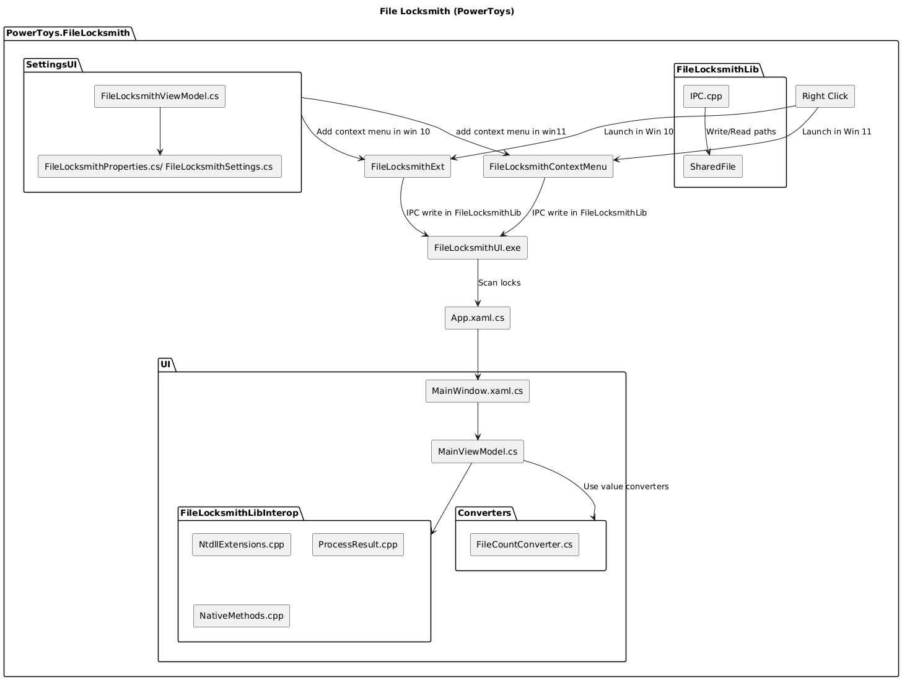

# File Locksmith

[Public overview - Microsoft Learn](https://learn.microsoft.com/en-us/windows/powertoys/file-locksmith)

## Quick Links

[All Issues](https://github.com/microsoft/PowerToys/issues?q=is%3Aopen%20label%3A%22Product-File%20Locksmith%22)<br>
[Bugs](https://github.com/microsoft/PowerToys/issues?q=is%3Aopen%20label%3A%22Product-File%20Locksmith%22%20label%3AIssue-Bug)<br>
[Pull Requests](https://github.com/microsoft/PowerToys/pulls?q=is%3Apr+is%3Aopen+label%3A%22Product-File+Locksmith%22)

## Overview

File Locksmith is a utility in PowerToys that shows which processes are locking or using a specific file. This helps users identify what's preventing them from deleting, moving, or modifying files by revealing the processes that have handles to those files.

## Architecture



File Locksmith follows a similar architecture to the ImageResizer and NewPlus modules. It consists of:

1. **Shell Extensions**:
   - `FileLocksmithExt` - COM-based shell extension for Windows 10 and below
   - `FileLocksmithContextMenu` - Shell extension for Windows 11 context menu

2. **Core Components**:
   - `FileLocksmithLib` - Handles IPC between shell extensions and UI
   - `FileLocksmithLibInterop` - Core functionality for finding processes locking files
   - `FileLocksmithUI` - WinUI 3 user interface component

3. **Settings Integration**:
   - Settings integration in the PowerToys settings application

## Implementation Details

### Shell Extensions

The module adds "Unlock with File Locksmith" to the context menu in File Explorer:

- For Windows 11, a context menu command is registered as a MSIX sparse package (compiled via appxmanifest.xml)
- For Windows 10 and below, a traditional shell extension is registered through registry keys during installation

### Process Communication Flow

1. User enables File Locksmith in PowerToys settings
2. User right-clicks on a file and selects "Unlock with File Locksmith"
3. The shell extension writes the selected file path to a temporary file (file-based IPC)
4. The shell extension launches `PowerToys.FileLocksmithUI.exe`
5. The UI reads the file path from the temporary file
6. The UI uses `FileLocksmithLibInterop` to scan for processes with handles to the file
7. Results are displayed in the UI, showing process information and allowing user action

### Core Functionality

The core functionality to find processes locking files is implemented in [FileLocksmith.cpp](/src/modules/FileLocksmith/FileLocksmithLibInterop/FileLocksmith.cpp), which:

- Uses low-level Windows APIs via `NtdllExtensions` to iterate through file handles
- Examines all running processes to find handles to the specified files
- Maps process IDs to the files they're locking
- Retrieves process information such as name, user context, and file paths

### User Interface

The UI is built with WinUI 3 and uses MVVM architecture:
- View models handle process data and user interactions
- Converters transform raw data into UI-friendly formats
- The interface shows which processes are locking files, along with icons and process details

## Code Structure

### Shell Extensions
- [ClassFactory.cpp](/src/modules/FileLocksmith/FileLocksmithExt/ClassFactory.cpp): COM class factory that creates instances of shell extension objects
- [ExplorerCommand.cpp](/src/modules/FileLocksmith/FileLocksmithExt/ExplorerCommand.cpp): Implements Windows Explorer context menu command for Windows 10 and below
- [PowerToysModule.cpp](/src/modules/FileLocksmith/FileLocksmithExt/PowerToysModule.cpp): PowerToys module interface implementation with settings management
- [dllmain.cpp](/src/modules/FileLocksmith/FileLocksmithExt/dllmain.cpp): DLL entry point for Windows 10 shell extension
- [dllmain.cpp](/src/modules/FileLocksmith/FileLocksmithContextMenu/dllmain.cpp): Windows 11 context menu integration through MSIX package

### Core Libraries
- [IPC.cpp](/src/modules/FileLocksmith/FileLocksmithLib/IPC.cpp): File-based inter-process communication between shell extensions and UI
- [Settings.cpp](/src/modules/FileLocksmith/FileLocksmithLib/Settings.cpp): Settings management for File Locksmith module
- [FileLocksmith.cpp](/src/modules/FileLocksmith/FileLocksmithLibInterop/FileLocksmith.cpp): Core process scanning implementation to find processes locking files
- [NativeMethods.cpp](/src/modules/FileLocksmith/FileLocksmithLibInterop/NativeMethods.cpp): Interop layer bridging native C++ with WinRT-based UI
- [NtdllBase.cpp](/src/modules/FileLocksmith/FileLocksmithLibInterop/NtdllBase.cpp): Interface to native Windows NT APIs
- [NtdllExtensions.cpp](/src/modules/FileLocksmith/FileLocksmithLibInterop/NtdllExtensions.cpp): Process and handle querying utilities using NtQuerySystemInformation
- [ProcessResult.cpp](/src/modules/FileLocksmith/FileLocksmithLibInterop/ProcessResult.cpp): Class for storing process information (name, PID, user, file list)

### UI Components
- [FileCountConverter.cs](/src/modules/FileLocksmith/FileLocksmithUI/Converters/FileCountConverter.cs): Converts file counts for UI display
- [FileListToDescriptionConverter.cs](/src/modules/FileLocksmith/FileLocksmithUI/Converters/FileListToDescriptionConverter.cs): Formats file lists for display
- [PidToIconConverter.cs](/src/modules/FileLocksmith/FileLocksmithUI/Converters/PidToIconConverter.cs): Extracts icons for processes
- [UserToSystemWarningVisibilityConverter.cs](/src/modules/FileLocksmith/FileLocksmithUI/Converters/UserToSystemWarningVisibilityConverter.cs): Shows warnings for system processes
- [MainWindow.xaml.cs](/src/modules/FileLocksmith/FileLocksmithUI/FileLocksmithXAML/MainWindow.xaml.cs): Main application window implementation
- [App.xaml.cs](/src/modules/FileLocksmith/FileLocksmithUI/FileLocksmithXAML/App.xaml.cs): Application entry point
- [ResourceLoaderInstance.cs](/src/modules/FileLocksmith/FileLocksmithUI/Helpers/ResourceLoaderInstance.cs): Localization resource helper
- [MainViewModel.cs](/src/modules/FileLocksmith/FileLocksmithUI/ViewModels/MainViewModel.cs): Main view model that handles loading processes asynchronously

### Settings Integration
- [FileLocksmithViewModel.cs](/src/settings-ui/Settings.UI/ViewModels/FileLocksmithViewModel.cs): ViewModel for File Locksmith in PowerToys settings
- [FileLocksmithLocalProperties.cs](/src/settings-ui/Settings.UI.Library/FileLocksmithLocalProperties.cs): Machine-level settings storage
- [FileLocksmithProperties.cs](/src/settings-ui/Settings.UI.Library/FileLocksmithProperties.cs): User-level settings storage
- [FileLocksmithSettings.cs](/src/settings-ui/Settings.UI.Library/FileLocksmithSettings.cs): Module settings definitions

## Debugging

To build and debug the File Locksmith module:

0. **Build FileLocksmith module**
   - Open the solution in Visual Studio
   - Build the entire solution
   - Build the `FileLocksmith` project

1. **Get Certificate Thumbprint**
   ```powershell
   New-SelfSignedCertificate -Subject "CN=Microsoft Corporation, O=Microsoft Corporation, L=Redmond, S=Washington, C=US" `
    -KeyUsage DigitalSignature `
    -Type CodeSigningCert `
    -FriendlyName "PowerToys SelfCodeSigning" `
    -CertStoreLocation "Cert:\CurrentUser\My"

   Get-ChildItem -Path Cert:\CurrentUser\My | Where-Object { $_.FriendlyName -like "*PowerToys*" }
    ```

2. **Sign the MSIX package**
   ```
   SignTool sign /fd SHA256 /sha1 <THUMBPRINT> "C:\Users\$env:USERNAME\source\repos\PowerToys\x64\Debug\WinUI3Apps\FileLocksmithContextMenuPackage.msix"
   ```
   SignTool might be not in your PATH, so you may need to specify the full path to it, e.g., `C:\Program Files (x86)\Windows Kits\10\bin\<version>\x64\signtool.exe`.

   **commands example**:
   ```powershell
      PS C:\Users\gkhmyznikov> New-SelfSignedCertificate -Subject "CN=Microsoft Corporation, O=Microsoft Corporation, L=Redmond, S=Washington, C=US" `
      >>     -KeyUsage DigitalSignature `
      >>     -Type CodeSigningCert `
      >>     -FriendlyName "PowerToys SelfSigned" `
      >>     -CertStoreLocation "Cert:\CurrentUser\My"

         PSParentPath: Microsoft.PowerShell.Security\Certificate::CurrentUser\My

      Thumbprint                                Subject              EnhancedKeyUsageList
      ----------                                -------              --------------------
      1AA018C2B06B60EAFEE452ADE403306F39058FF5  CN=Microsoft Corpor… Code Signing

      PS C:\Users\gkhmyznikov> Get-ChildItem -Path Cert:\CurrentUser\My | Where-Object { $_.FriendlyName -like "*PowerToys*" }

         PSParentPath: Microsoft.PowerShell.Security\Certificate::CurrentUser\My

      Thumbprint                                Subject              EnhancedKeyUsageList
      ----------                                -------              --------------------
      1AA018C2B06B60EAFEE452ADE403306F39058FF5  CN=Microsoft Corpor… Code Signing

      PS C:\Users\gkhmyznikov> & "C:\Program Files (x86)\Windows Kits\10\bin\10.0.26100.0\x64\signtool.exe" sign /fd SHA256 /sha1 1AA018C2B06B60EAFEE452ADE403306F39058FF5 "C:\Users\$env:USERNAME\Develop\GitHub\PowerToys\x64\Debug\WinUI3Apps\FileLocksmithContextMenuPackage.msix"
      Done Adding Additional Store
      Successfully signed: C:\Users\gkhmyznikov\Develop\GitHub\PowerToys\x64\Debug\WinUI3Apps\FileLocksmithContextMenuPackage.msix
   ```

3. **Remove old version**
   ```powershell
   Get-AppxPackage -Name Microsoft.PowerToys.FileLocksmithContextMenu*
   Remove-AppxPackage Microsoft.PowerToys.FileLocksmithContextMenu_1.0.0.0_neutral__8wekyb3d8bbwe
   ```

4. **Replace current MSIX with debug version**
   ```
   cp "C:\Users\$env:USERNAME\source\repos\PowerToys\x64\Debug\WinUI3Apps\FileLocksmithContextMenuPackage.msix" "C:\Users\$env:USERNAME\AppData\Local\PowerToys\WinUI3Apps\"
   cp "C:\Users\$env:USERNAME\source\repos\PowerToys\x64\Debug\WinUI3Apps\FileLocksmithContextMenuPackage.dll" "C:\Users\$env:USERNAME\AppData\Local\PowerToys\WinUI3Apps\"
   ```

5. **Restart Explorer**
   - Go to Task Manager and restart explorer.exe

6. **Debug Process**
   - Right-click a file and select "Unlock with File Locksmith"
   - Attach the debugger to dllhost.exe to debug the shell extension
   - Attach the debugger to FileLocksmithUI.exe to debug the UI

## Known Issues

There is an open PR to change the IPC mechanism from file-based to pipe-based, but it has blockers:
- When restarting as admin, the context menu extension doesn't show
- The "Unlock with File Locksmith" option doesn't work when launched as admin

## Settings Integration

File Locksmith integrates with the PowerToys settings through:
- [FileLocksmithViewModel.cs](/src/settings-ui/Settings.UI/ViewModels/FileLocksmithViewModel.cs)
- [FileLocksmithLocalProperties.cs](/src/settings-ui/Settings.UI.Library/FileLocksmithLocalProperties.cs)
- [FileLocksmithProperties.cs](/src/settings-ui/Settings.UI.Library/FileLocksmithProperties.cs)
- [FileLocksmithSettings.cs](/src/settings-ui/Settings.UI.Library/FileLocksmithSettings.cs)
